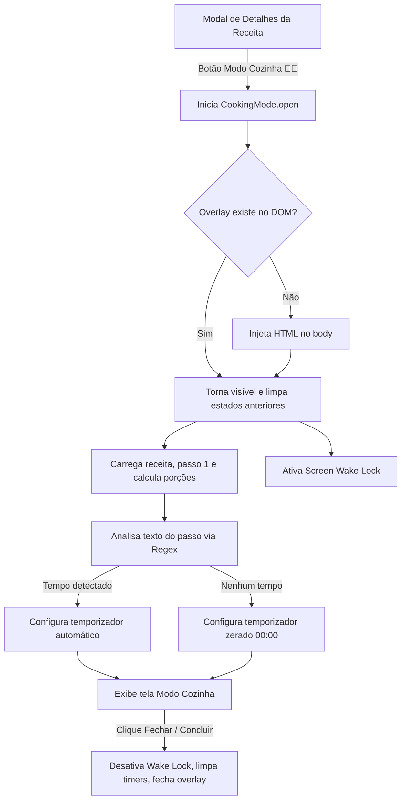

# Design Spec: Modo Cozinha com Temporizadores

**Data:** 2026-07-15  
**Autor:** Antigravity (AI pair programmer)  
**Status:** Em Revisão  
**Projeto:** Chef Digital (Livro de Receitas & Planejador)

---

## 1. Visão Geral (Overview)

O **Modo Cozinha** é uma funcionalidade que transforma a visualização tradicional de uma receita em uma interface de tela cheia otimizada para o preparo ativo na cozinha. Com foco em usabilidade de mãos livres, tipografia em escala para visualização à distância e controle integrado de tempo (temporizadores), o objetivo é permitir que o usuário siga o passo a passo da receita com zero atrito de navegação.

---

## 2. Objetivos (Goals & Non-Goals)

### Objetivos (Goals)
* Apresentar o modo de preparo passo a passo em formato unitário (um passo por vez) com tipografia gigante.
* Detectar automaticamente menções de tempo de cozimento/espera no texto de cada passo via regex e sugerir um temporizador pronto para iniciar.
* Permitir ajustes manuais rápidos no temporizador (+1 min, -1 min, +5 min, -5 min) ou configuração totalmente manual quando a detecção automática falhar ou não for aplicável.
* Notificar o usuário visual e sonoramente (som dinâmico via Web Audio API) quando um temporizador for zerado.
* Manter a tela ativa no dispositivo usando a Screen Wake Lock API enquanto o Modo Cozinha estiver aberto.
* Manter total compatibilidade com execução offline e o protocolo local `file://`.

### Não-Objetivos (Non-Goals)
* Alterar o esquema ou os dados do arquivo de receitas estático [receitas.js](file:///C:/Sistemas/Projetos/receitas/receitas.js).
* Adicionar suporte a múltiplos temporizadores concorrentes na mesma tela (apenas um temporizador por passo é necessário).
* Adicionar controle de voz (hands-free avançado) nesta versão inicial.

---

## 3. Arquitetura e Fluxo de Integração

O Modo Cozinha será implementado em um arquivo de script modular dedicado, [cooking-mode.js](file:///C:/Sistemas/Projetos/receitas/cooking-mode.js), para manter a organização e evitar o inchaço do arquivo principal [index.html](file:///C:/Sistemas/Projetos/receitas/index.html).

### Fluxo de Funcionamento:

---

## 4. Especificação de Interface (UI) e Estilo (CSS)

A camada de interface será injetada como `#cooking-mode-overlay` no `<body>`. Suas regras de estilo serão adicionadas ao final do arquivo [estilos.css](file:///C:/Sistemas/Projetos/receitas/estilos.css).

### Layout dos Componentes (Opção A):
* **Fundo:** Adapta-se ao tema ativo (`light` ou `dark` do atributo `data-theme` da página), usando cores neutras para máximo contraste e legibilidade.
* **Passo Ativo:** Exibido centralizado em tipografia serifada `Playfair Display`, peso 600, tamanho `2rem` (ou mais em telas desktop/tablet) e line-height de `1.5` para fácil leitura à distância de 1 a 2 metros.
* **Controles do Temporizador:**
  * Painel numérico central de tamanho generoso (`font-size: 3.5rem`, mono-espaçado).
  * Botões de Ação Circular com tamanho de toque de no mínimo `48px x 48px`.
  * Botões de incremento rápido (+1 min, +5 min) e decremento rápido (-1 min, -5 min).
* **Navegação (Setas Laterais / Inferiores):**
  * Botões gigantes "Anterior" e "Próximo" nas laterais ou no rodapé para navegação fácil com toque rápido.

---

## 5. Lógica de Negócio e Algoritmos

### 5.1. Expressão Regular (Regex) para Parsing de Tempo
O arquivo [cooking-mode.js](file:///C:/Sistemas/Projetos/receitas/cooking-mode.js) implementará um parser que processa o texto do passo ativo para identificar tempos e converter tudo para segundos. As regras principais serão:

1. **Horas e Minutos Combinados:** Ex: `1 hora e 30 minutos` ou `2h e 15min`.
   * Regex: `/(\d+)\s*(?:horas?|h|hs)\s*(?:e\s*)?(\d+)\s*(?:minutos?|min|mins)/i`
2. **Faixas de Tempo:** Ex: `15 a 20 minutos`. Captura o valor máximo (limite de segurança).
   * Regex: `/(\d+)\s*(?:a|ou|-)\s*(\d+)\s*(?:minutos?|min|mins)/i`
3. **Minutos simples:** Ex: `10 minutos`, `5 min`.
   * Regex: `/(\d+)\s*(?:minutos?|min|mins)\b/i`
4. **Horas simples:** Ex: `2 horas`, `1h`.
   * Regex: `/(\d+)\s*(?:horas?|h|hs)\b/i`

### 5.2. Alarme Sonoro (Web Audio API)
Quando o cronômetro atinge 0 segundos:
* Inicia-se a emissão de bipes eletrônicos usando `AudioContext` nativo, com oscilador de onda senoidal de `880Hz` e controle de ganho (`GainNode`) para suavizar o início e fim de cada bipe.
* Toca 3 bipes de 300ms a cada 3 segundos, até que o usuário clique em "OK", "Silenciar" ou navegue para outro passo.

### 5.3. Screen Wake Lock
* Mantém o dispositivo awake chamando `navigator.wakeLock.request('screen')` e guardando o `WakeLockSentinel`.
* Trata o retorno à aba re-solicitando o bloqueio ao detectar o evento `visibilitychange`.

---

## 6. Tratamento de Casos de Borda (Edge Cases)

* **Nenhum tempo detectado:** O temporizador inicia zerado (`00:00`), exibindo os botões de ajuste manual para o usuário adicionar tempo se desejar.
* **Browser não suporta Wake Lock:** O app captura a exceção de falha graciosamente e loga um aviso no console, permitindo o funcionamento normal das outras partes.
* **Mudança de Aba / Bloqueio pelo OS:** Ao pausar o app, cancelamos o temporizador visual (evitando descompasso) e registramos o carimbo de data/hora (`Date.now()`). Ao retomar, calculamos o tempo decorrido no mundo real para corrigir e atualizar a contagem regressiva se o timer estava ativo.

---

## 7. Estratégia de Teste e Validação

1. **Testes do Parser de Tempo (Regex):**
   * Criar uma suíte de testes em um script isolado (ou log no console) injetando strings variadas para verificar se o tempo gerado em segundos está correto.
2. **Validação de Responsividade:**
   * Testar a interface em resoluções mobile, tablet e desktop para garantir que o tamanho das fontes e botões permaneça adequado para leitura e clique.
3. **Teste de Áudio e Wake Lock:**
   * Executar localmente e testar em dispositivos reais (smartphone Android/iOS) para certificar-se de que a tela não desliga e o som de alarme toca conforme esperado.
